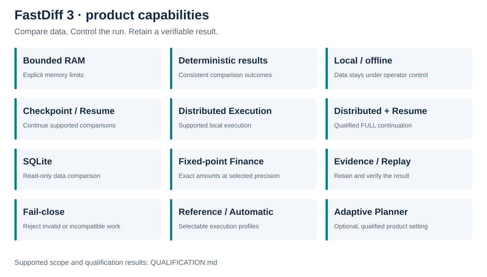
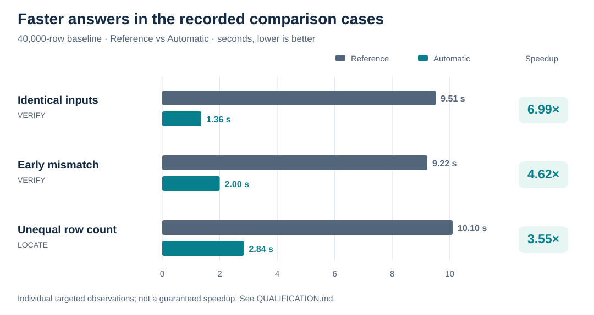
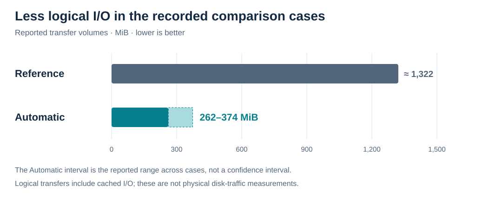

# FastDiff 3

**Exact data comparison. Bounded memory. Results you can verify.**

FastDiff 3 is a deterministic offline reconciliation product for large structured datasets. Compare data states, locate the first difference or obtain a complete difference report, with retained evidence for verification. Designed for **Windows x64** and **private commercial distribution**.

## Choose the answer you need

| Mode | Operational question | Result |
| --- | --- | --- |
| **VERIFY** | Are these datasets equal under the selected comparison settings? | An exact identical/different decision. |
| **LOCATE** | Where is the first difference? | The first mismatch in the product's deterministic comparison order. |
| **FULL** | What changed across the complete dataset? | A complete difference report for the selected comparison scope. |

Use FastDiff to check migration exports, compare inventory snapshots, reconcile ledger states or validate successive data deliveries. Results refer to the selected inputs and comparison settings.

## Product capabilities

| Capability | What it delivers | Supported scope |
| --- | --- | --- |
| **Bounded RAM** | Explicit memory limits for large comparisons. | Windows memory guard; the operator must also allow sufficient local storage. |
| **Deterministic results** | Consistent results for the same data and comparison settings. | Verified agreement across the supported execution and continuation cases. |
| **Local / offline** | Data comparison and replay on the operator's machine. | No external service is required for these operations. |
| **Checkpoint / Resume** | Save progress, stop at a supported checkpoint and continue later. | Resume requires compatible settings and unchanged input data. |
| **Distributed Execution** | A local distributed execution option for supported comparisons. | Verified for VERIFY, LOCATE and FULL in the documented cases. |
| **Distributed Checkpoint / Resume** | Continue a distributed comparison after a controlled stop. | Qualified for **FULL**; no arbitrary crash or power-loss recovery claim. |
| **SQLite** | Read-only comparison of supported SQLite data. | Use a stable, supported database snapshot. |
| **Fixed-point Finance** | Exact monetary comparisons and totals at the selected precision. | No rounding or currency conversion. |
| **Evidence / Replay** | Retain comparison evidence and verify the recorded result. | Keep the complete evidence bundle and its trusted integrity reference. |
| **Fail-close** | Reject invalid or incompatible operations instead of accepting a successful verified result. | Includes failed verification and incompatible continuation data. |
| **Reference / Automatic Execution** | Select an execution profile appropriate to the task. | Result agreement is verified in the published qualification cases. |
| **Adaptive Planner** | An optional execution setting with verified result consistency. | PASS in the documented final integration and Windows smoke checks. |

## From comparison to verification

1. **Select the data and comparison settings.** Define the scope of the result.
2. **Choose VERIFY, LOCATE or FULL.** Select a supported execution profile and memory budget.
3. **Run locally.** Use checkpoint/resume or distributed execution where supported.
4. **Review and retain the result.** Preserve the evidence and run replay when verification is required.

## Verified qualification results

### Targeted 40,000-row comparison measurements

The following are recorded **Reference versus Automatic** observations for a 40,000-row-per-input baseline. They are not a comparison against another product or a guaranteed speedup.

| Scenario | Mode | Reference | Automatic | Observed speedup |
| --- | --- | ---: | ---: | ---: |
| Identical inputs | VERIFY | 9.51 s | 1.36 s | **6.99×** |
| Early mismatch | VERIFY | 9.22 s | 2.00 s | **4.62×** |
| Unequal row count | LOCATE | 10.10 s | 2.84 s | **3.55×** |

Reported logical I/O decreased from approximately **1,322 MiB** for Reference to **262–374 MiB** for Automatic across these cases.

These are individual targeted measurements, not repeated statistical estimates. Timings include initial data preparation and result output. Operating-system caches were not explicitly cleared. Logical I/O is not physical disk traffic. The rounded speedups are reported measurements, rather than recalculations from the rounded times displayed here. See [qualification scope](QUALIFICATION.md#measurement-scope).

### Continuation, correctness and product checks

| Qualification area | Confirmed result |
| --- | --- |
| Checkpoint / Resume | **40,000 canonical rows** and **10,000 committed comparison pairs** reused; **9,999 payload comparisons avoided**. Final result, events and result identifier (RID) preserved across resume. |
| Distributed FULL | Execution Off/On produced equal final results, events and RID. |
| Distributed LOCATE | The first difference in the defined order was returned despite out-of-order worker completion. |
| Distributed reliability | Retry without duplicate counting; altered receipt rejection; gap rejection; recursive repartition PASS; VERIFY cancellation PASS. |
| Final integration | **23 product functions have PASS qualification sources.** Adaptive Planner and Distributed + Checkpoint/Resume passed their scoped integration checks. |
| Final Windows production smoke | **PASS** for VERIFY, LOCATE, FULL, Reference, Automatic, Adaptive Planner, Checkpoint/Resume, Distributed, Distributed + Checkpoint/Resume, SQLite, Finance, Licensing, Replay and Memory Guard. |

The targeted timings, continuation results, integration checks and production smoke are distinct evidence sets. The timing table is not a benchmark of the final production executable. PASS applies to the stated cases; it does not imply that every possible feature combination was tested or that distributed execution is always faster. The checkpoint reuse figures belong to the standalone continuation check, not the distributed continuation check.

[Read the full public qualification summary →](QUALIFICATION.md)

## Scope and release status

| Item | Status |
| --- | --- |
| Product | FastDiff **3.0.0**, proprietary commercial software. |
| Qualified platform | **Windows x64**. |
| Windows production smoke | **PASS** for the functions listed above. |
| Executable code signing | The qualified private Windows build is **unsigned**; operating-system trust is separate from application licensing. |
| Delivery | Private commercial distribution. No application download is provided here. |
| This repository | Product documentation and presentation graphics only; no implementation, executable, customer license or development archive. |

Exact results are bounded by the chosen comparison settings and input data. Replay verifies the recorded comparison; it is not a certification of the truth or business correctness of the source data. Controlled checkpoint continuation does not imply recovery from arbitrary interruption or power loss.

## Documentation and package integrity

- [Qualification](QUALIFICATION.md) — measured results, PASS cases and their limits.
- [Privacy](PRIVACY.md) — local data handling and evidence retention.
- [Security](SECURITY.md) — verification, operating boundaries and private issue reporting.
- [Release notes](RELEASE_NOTES.md) — product and documentation delivery status.
- [SHA-256 checksums](SHA256SUMS.txt) — integrity values for the documentation files and graphics.
- [License](LICENSE) and [notice](NOTICE) — proprietary terms and repository scope.

`SHA256SUMS.txt` covers every documentation file and graphic except itself. Checksum agreement establishes file integrity, not authorship or independent product certification. Compare against a checksum list obtained through a trusted channel.
